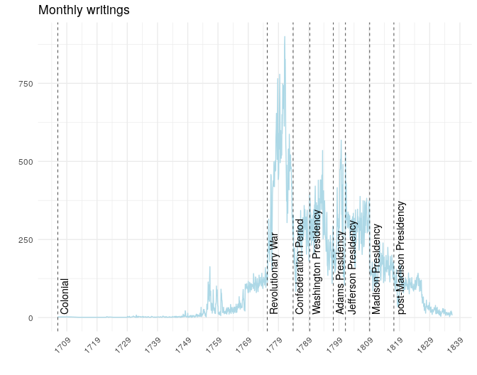
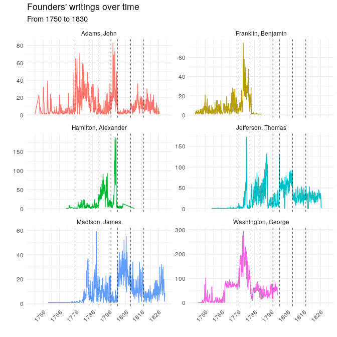

Founders Archives Corpus
------------------------

The folks at the [National Archives]() … These texts are made available
… Here, we make them available as simple RDS & CSV files. The R-code for
extracting data from Founders Online is available [here]().

A quick description of the Founders Archives Corpus (FAC).

-   [Founders Online](https://founders.archives.gov/)
-   [Corpus of Founding Era American
    English](https://lcl.byu.edu/projects/cofea/)
-   [BYU Law Corpora](https://lawcorpus.byu.edu/)

And some potential ideas via [LESSON
PLANS](https://founders.archives.gov/content/lesson_plans) – !


### Data

``` r
if (!require("pacman")) install.packages("pacman")
pacman::p_load(magrittr, dplyr, tidyr, ggplot2, data.table)
setwd(local)
ffc <- readRDS("founding-fathers-corpus.rds")
```

Richmond. Winchester: Tuesday January 6th 1756.

Whereas it has been represented to Colonel Washington, that Ensign
Dekeyser has been guilty of a breach of the twenty-third article of War;
by behaving in a manner unbecoming the character of a Gentleman, and an
Officer—He is ordered to appear before a Court of enquiry, which will
sit to examine into the complaint to-morrow at ten of the clock. The
Court to consist of nine Officers; none under the degree of a
Captain—Lieutenant Colonel Stephen, President. All Evidences to attend.

### Some descriptives

``` r
founders <- c('Washington, George', 'Adams, John', 'Jefferson, Thomas', 
              'Madison, James', 'Hamilton, Alexander', 'Franklin, Benjamin')
```

Letters & word counts historically – by author – plot over time.

``` r
data.table::setDT(ffc)

ffc[, doc_length := lengths(gregexpr("\\W+", text))]

ffc$Month_Yr <- sub('-[0-9]*$', '', ffc$date_from)
ffc$Month_Yr <- as.Date(paste0(ffc$Month_Yr, '-01'), format = '%Y-%m-%d')
  
by_year <-ffc[, list(letters_sent = .N, 
                  word_count = sum(doc_length),
                  unique_tos = length(unique(recipients))), 
           by = list(Month_Yr,authors)]
```

As table:

| period                  | general   | start      | end        |
|:------------------------|:----------|:-----------|:-----------|
| Colonial                | 1706-1775 | 1706-01-01 | 1775-04-18 |
| Revolutionary War       | 1775-1783 | 1775-04-19 | 1783-09-03 |
| Confederation Period    | 1783-1789 | 1783-11-04 | 1789-04-29 |
| Washington Presidency   | 1789-1797 | 1789-04-30 | 1797-03-03 |
| Adams Presidency        | 1797-1801 | 1797-03-04 | 1801-03-03 |
| Jefferson Presidency    | 1801-1809 | 1801-03-04 | 1809-03-03 |
| Madison Presidency      | 1809-1817 | 1809-03-04 | 1817-03-03 |
| post-Madison Presidency | 1817+     | 1817-03-04 | 1837-01-01 |

``` r
by_year %>%
  filter(!is.na(Month_Yr)) %>%
  group_by(Month_Yr) %>%
  summarize(letters_sent = sum(letters_sent)) %>%
  
  ggplot(aes(x = Month_Yr, 
             y = letters_sent)) +
  geom_line(size=.5, color = 'lightblue') +
  
  geom_vline(xintercept = Period_table$start,
             linetype =2, 
             color = 'black', 
             size = .25) +
   annotate(geom="text", 
            x = Period_table$start + 750, 
            y = 10, 
            label =Period_table$period,
            size = 3.75,
            angle = 90,
            hjust = 0) +
  scale_x_date(labels = scales::date_format("%Y"),
               breaks = scales::date_breaks('10 year')) +
  theme_minimal() +
  ylab ("") + xlab("") +
  theme(legend.position="none",
        axis.text.x = element_text(angle = 45, hjust = 1)) + 
  labs(title = "Monthly writings")
```



We need to figure out date stuff below – in ggplot –

``` r
x1 <- by_year %>%
  filter(authors %in% founders) %>%
  filter(Month_Yr < as.Date('1830-01-01'),
         Month_Yr > as.Date('1750-01-01')) 

x1 %>%
  ggplot(aes(x = Month_Yr, 
             y = letters_sent, 
             color = authors,
             group = authors)) +
  geom_line(size=.5) +
  
  geom_vline(xintercept = Period_table$start,
             linetype =2, 
             color = 'black', 
             size = .25) +
  
  theme_minimal() +
  theme(legend.position="none",
        axis.text.x = element_text(angle = 45, hjust = 1))+
  ylab ("") + xlab("") +
  scale_x_date(labels = scales::date_format("%Y"),
               breaks = scales::date_breaks('10 year')) +
  facet_wrap(~authors, 
             scales = "free_y", 
             ncol=2) + 
  labs(title = "Founders' writings over time",
       subtitle = 'From 1750 to 1830')
```



### General thoughts:
