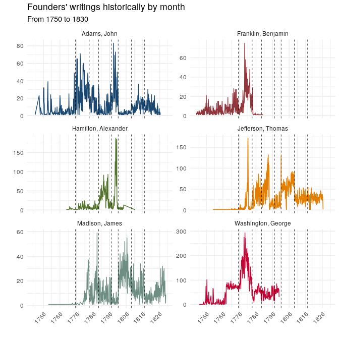
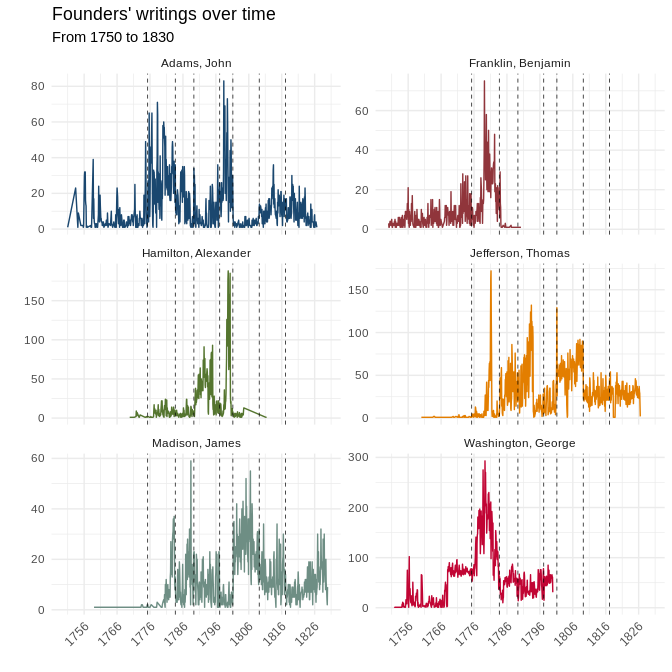

Founders Archives Corpus
------------------------

[Founders Online](https://founders.archives.gov/) is a [National
Archives](https://www.archives.gov/) resource that makes available
\~180K writings/letters of the Founders of the United States of America.
A treasure trove. Here, we simply extract (via
[API](https://founders.archives.gov/API/docdata/)) all
documents/metadata included in Founders Online, and collate them as a
collection of R-based `RDS` files.
[R-Script](https://github.com/jaytimm/founders_archive_corpus/blob/master/scrape_founders_archive.R).
[RDS
Files](https://github.com/jaytimm/founders_archive_corpus/tree/master/data).


### Load corpus

``` r
if (!require("pacman")) install.packages("pacman")
pacman::p_load(magrittr, dplyr, tidyr, ggplot2, data.table)
```

Gather files. Aggregate as single data frame.

``` r
setwd(local)
gfiles <- list.files(path = local, 
                     pattern = "rds", 
                     recursive = TRUE) 

ffc <- lapply(gfiles, readRDS) %>% data.table::rbindlist()
```

Columns included in dataset are presented below.

``` r
colnames(ffc)
```

    ##  [1] "title"      "permalink"  "project"    "authors"    "recipients"
    ##  [6] "date_from"  "date_to"    "api"        "og_text"    "text"      
    ## [11] "period"

A simple function for displaying document with some metadata inline in a
`RMD` file.

``` r
display_letter <- function(x) {
  a1 <- strsplit(x$og_text, '\n')[[1]]
  a2 <- trimws(a1)
  a3 <- subset(a2, a2 != '')
  a4 <- paste(a3, collapse = '\n')
  a4a <-paste0('Author: ', x$author, '\n>', 
               'Recipient: ', x$recipient, '\n>', 
               'Date: ', x$date_to, '\n>', 
               'Period: ', x$period, '\n>\n', 
               a4)
  a5 <- gsub(' *\n', '  \n', a4a)
  paste('>', gsub(' *(\n*) *$', '\\1', a5))
}
#cat(display_letter(ffc[150681,]))
#`r display_letter(ffc[150681,])`
```

**A letter from Thomas Jefferson to Benjamin Franklin** with an
“inclosed paper” – presumably a draft of the *Declaration of
Independence*. Well said, sir!!

> Author: Jefferson, Thomas  
> Recipient: Franklin, Benjamin  
> Date: 1776-06-21  
> Period: Revolutionary War
>
> Th: J. to Doctr. Franklyn  
> Friday morn. \[21 June 1776?\]  
> The inclosed paper has been read and with some small alterations
> approved of by the committee. Will Doctr. Franklyn be so good as to
> peruse it and suggest such alterations as his more enlarged view of
> the subject will dictate? The paper having been returned to me to
> change a particular sentiment or two, I propose laying it again before
> the committee tomorrow morning, if Doctr. Franklyn can think of it
> before that time.

A corrrespondance from **George Washington to Benjamin Tallmadge**
discussing a couple of Washington’s spies, the Culpers.

> Author: Washington, George  
> Recipient: Tallmadge, Benjamin  
> Date: 1780-07-11  
> Period: Revolutionary War
>
> Dear Sir  
> Head Quarters Bergen County 11th July 1780  
> As we may every moment expect the arrival of the French Fleet a
> revival of the correspondence with the  
> Culpers will be of very great importance. If the younger cannot be
> engaged again, you will endeavour to prevail upon the  
> elder to give you information of the movements and position of the
> enemy upon Long Island—as whether they are all  
> confined to the post at Brooklyn or whether they have any detached
> posts and where, and what is their strength at those  
> posts—in short desire him to inform you of whatever comes under his
> notice and which seems worthy of communication. You  
> will transmit your letters to Genl Howe, who will forward them to me.
> I am, &c.  
> P.S. desire him to attend particularly to the provision which they are
> making of Wood and Forage—and  
> whether they drive in any stock.

**John Adams to Benjamin Franklin** post-Revolutionary War.

> Author: Adams, John  
> Recipient: Franklin, Benjamin  
> Date: 1784-06-29  
> Period: Confederation Period
>
> Sir  
> The Hague June 29. 1784  
> The Baron de Reishack, has several times said to me that his Court
> expected that Congress would announce formally their Independence, and
> asked me, if any Step of that Sort had been taken. that I may be able
> to give him an Answer, I must request of your Excellency to inform me
> whether you have made the Annunciation directed in the first Article
> of the Instructions of the 29 of October 1783 and what is the
> answer.  
> I have the Pleasure to learn, by report only however that Mr Jay is
> appointed Minister of foreign Affairs and that Mr Jefferson is
> appointed to Madrid, and that Mr Johnson has received and transmitted
> to your Excellency, a Packet which probably contains an authentic
> Account, as it Seems to be posteriour to the Appointment, by being
> addressed only to your Excellency and to me. I Should be glad to know
> whether there is any Thing else of Consequence, and whether it appears
> to be the design and Expectation of Congress that I should join you,
> where you are.

### Some descriptives

Letters & word counts historically – by author – plot over time.

``` r
data.table::setDT(ffc)

ffc[, doc_length := lengths(gregexpr("\\W+", text))]

ffc$Month_Yr <- sub('-[0-9]*$', '', ffc$date_from)
ffc$Month_Yr <- as.Date(paste0(ffc$Month_Yr, '-01'), format = '%Y-%m-%d')
  
by_year <-ffc[, list(letters_sent = .N, 
                  word_count = sum(doc_length),
                  unique_tos = length(unique(recipients))), 
           by = list(Month_Yr,authors)]
```

As table:

| period                  | general   | start      | end        |
|:------------------------|:----------|:-----------|:-----------|
| Colonial                | 1706-1775 | 1706-01-01 | 1775-04-18 |
| Revolutionary War       | 1775-1783 | 1775-04-19 | 1783-09-03 |
| Confederation Period    | 1783-1789 | 1783-09-04 | 1789-04-29 |
| Washington Presidency   | 1789-1797 | 1789-04-30 | 1797-03-03 |
| Adams Presidency        | 1797-1801 | 1797-03-04 | 1801-03-03 |
| Jefferson Presidency    | 1801-1809 | 1801-03-04 | 1809-03-03 |
| Madison Presidency      | 1809-1817 | 1809-03-04 | 1817-03-03 |
| post-Madison Presidency | 1817+     | 1817-03-04 | 1837-01-01 |

``` r
by_year %>%
  filter(!is.na(Month_Yr)) %>%
  group_by(Month_Yr) %>%
  summarize(letters_sent = sum(letters_sent)) %>%
  
  ggplot(aes(x = Month_Yr, 
             y = letters_sent)) +
  geom_line(size=.5, color = 'lightblue') +
  
  geom_vline(xintercept = Period_table$start,
             linetype =2, 
             color = 'black', 
             size = .25) +
   annotate(geom="text", 
            x = Period_table$start + 750, 
            y = 10, 
            label =Period_table$period,
            size = 3.75,
            angle = 90,
            hjust = 0) +
  scale_x_date(labels = scales::date_format("%Y"),
               breaks = scales::date_breaks('10 year')) +
  theme_minimal() +
  ylab ("") + xlab("") +
  theme(legend.position="none",
        axis.text.x = element_text(angle = 45, hjust = 1)) + 
  labs(title = "Monthly writings")
```



We need to figure out date stuff below – in ggplot –

``` r
founders <- c('Washington, George', 'Adams, John', 'Jefferson, Thomas', 
              'Madison, James', 'Hamilton, Alexander', 'Franklin, Benjamin')
```

``` r
x1 <- by_year %>%
  filter(authors %in% founders) %>%
  filter(Month_Yr < as.Date('1830-01-01'),
         Month_Yr > as.Date('1750-01-01')) 

x1 %>%
  ggplot(aes(x = Month_Yr, 
             y = letters_sent, 
             color = authors,
             group = authors)) +
  geom_line(size=.5) +
  
  geom_vline(xintercept = Period_table$start,
             linetype =2, 
             color = 'black', 
             size = .25) +
  
  theme_minimal() +
  ggthemes::scale_color_stata() +
  theme(legend.position="none",
        axis.text.x = element_text(angle = 45, hjust = 1))+
  ylab ("") + xlab("") +
  scale_x_date(labels = scales::date_format("%Y"),
               breaks = scales::date_breaks('10 year')) +
  facet_wrap(~authors, 
             scales = "free_y", 
             ncol=2) + 
  labs(title = "Founders' writings over time",
       subtitle = 'From 1750 to 1830')
```



### General thoughts:
